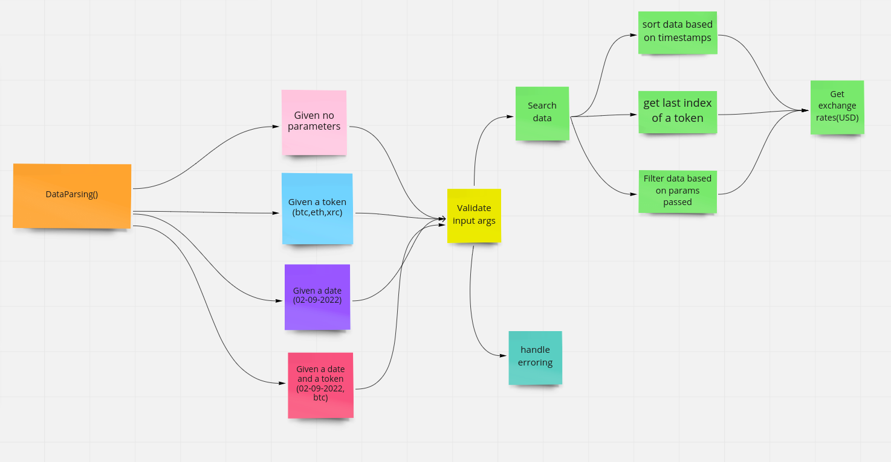

<h4 align="center">
  

📟 Digital Asset Portfolio Node.js CLI applications.

 
</h4>


# about-project 
- Write a command line program that does the following

```sh
Given no parameters, return the latest portfolio value per token in USD
Given a token, return the latest portfolio value for that token in USD
Given a date, return the portfolio value per token in USD on that date
Given a date and a token, return the portfolio value of that token in USD on that date
```

```sh
The CSV file has the following columns

timestamp: Integer number of seconds since the Epoch
transaction_type: Either a DEPOSIT or a WITHDRAWAL
token: The token symbol
amount: The amount transacted
````


<br>

[📟][repo]

## Install

```sh
# Recommended.
git clone repo

```
- unzip transaction.zip on digital_portfolio/src/data folder

- create account on [] and add the API_KEY  to .env 

<br>

[⚙️][repo]

## Usage
1. Install packages
```sh
npm install


```
 
2. Run the CLI using

```sh
npm start


```

_Then answer the following questions to generate a Node.js CLI._

```sh
npm start?
npm start token?
npm start timestamp?
npm start token timestamp?

```

#### BASIC USAGE
# argument example
```sh
- token [btc, eth, xrp]
- timestamp [90229622,90229750,90229767]
```


#### COMMANDS

```sh
npm start
npm start <token>
npm start <timestamp>
npm start <token timestamp>
```


<br>

    
<br>
[🙌][repo]
## workflow
<a href="#">
        
    </a>

[📃][repo]

## License & Conduct

- MIT © [Dickens Juma]()


<br>


